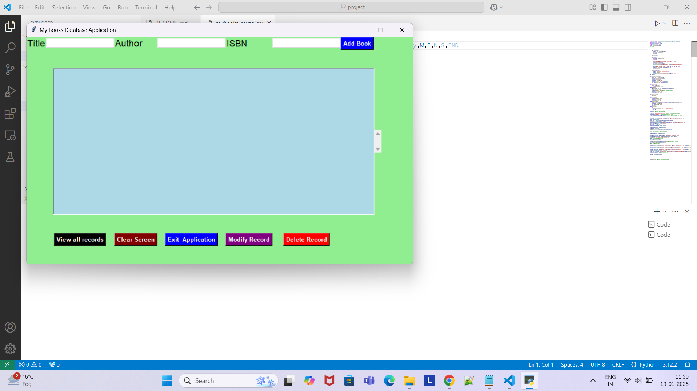

#  MyBooks Database Application
        MyBooks is a Python-based project that uses the tkinter module to create a Graphical User Interface (GUI) for managing a simple book database. It connects to a MySQL database to store and manage book information, such as title, author, and ISBN.

# Author: Reesu

### Overview
        This project is designed to demonstrate how to interact with a GUI using tkinter, manage a database using mysql-connector-python, and provide a seamless interface for CRUD (Create, Read, Update, Delete) operations. It includes three primary scripts:

        mybooks.py: Main application script for the GUI.
        mysql_config.py: Configuration file for MySQL database credentials.
        books.sql: SQL script to create the books table.
1. `mybooks.py`
        This script is the core application that interacts with the user.
        Features a responsive GUI with input fields, buttons, and a list box for displaying book records.
        Implements CRUD operations:
        Add a book.
        View all books.
        Update book details.
        Delete a book.
        Includes utility buttons for clearing inputs and exiting the application.
2. `mysql_config.py`
        Contains the configuration required to connect the application to a MySQL database.
        Ensure you update this file with your MySQL credentials before running the application.
        python
        Copy
        Edit
        dbconfig = {
            'user': 'your_username',
            'password': 'your_password',
            'host': 'your_host',
            'database': 'your_database'
        }
3. `books.sql`
        SQL script to set up the books table in the MySQL database.
        Use this script to initialize the database schema.
        sql
        Copy
        Edit
        CREATE TABLE books (
            id INT AUTO_INCREMENT PRIMARY KEY,
            title VARCHAR(255) NOT NULL,
            author VARCHAR(255) NOT NULL,
            isbn VARCHAR(20) NOT NULL
        );
### Detailed Steps to Run
        Set up the database:

        Import the books.sql file into your MySQL database.
        Configure MySQL connection:

        Update mysql_config.py with your database credentials.
        Run the application:

        Launch the mybooks.py script.
        Use the interface to manage your book records.
        Perform CRUD operations:

        Add a book using the input fields and the "ADD BOOK" button.
        View all records with the "VIEW" button.
        Update book details with the "MODIFY" button.
        Delete a book with the "DELETE" button.
### Pre-Requisites
        Ensure you have the following Python packages installed:

            mysql-connector-python:
            bash
            Copy
            Edit
            pip install mysql-connector-python
            tkinter (comes pre-installed with Python).
### Configuration
        Before running mybooks.py:

        Ensure the MySQL server is running and the books table is created using the books.sql script.
        Update the mysql_config.py file with your database credentials.
        Future Enhancements
        Add a search feature to find books by title, author, or ISBN.
        Implement pagination for large datasets.
        Add export functionality to save data in CSV or Excel format.
### Screenshots
        (Insert relevant screenshots here to showcase the application UI.)

### License
        This project is licensed under the MIT License.
